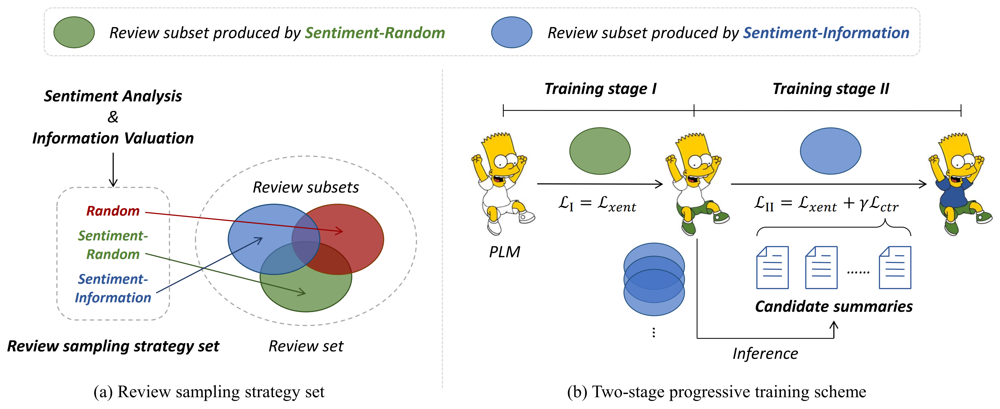

# Large-Scale and Multi-Perspective Opinion Summarization with Diverse Review Subsets

This repository contains the code for the paper *Large-Scale and Multi-Perspective Opinion Summarization with Diverse Review Subsets* (https://arxiv.org/abs/2310.13340) accepted to EMNLP 2023 Findings. **SubSumm** is a supervised summarization framework for large-scale multi-perspetcive opinion summarization with limited computational resource.

<p align="center">

</p>


## Setup

Please use the command below to setup the environment needed.
```
conda create -n subsumm python=3.7.0
conda activate subsumm
pip install -r requirements.txt
```

Then download [this version of FairSeq](https://abrazinskas.s3.eu-west-1.amazonaws.com/downloads/projects/selsum/fairseq_lib.zip) and store it to `./fairseq_lib`. In the unzipped directory are the installation instructions. 

```
export PYTHONPATH=./fairseq_lib/.:$PYTHONPATH
export MKL_THREADING_LAYER=GNU
```


## Data and Checkpoints

The preprocessed datasets, models fine-tuned for sentiment analysis and information valuation, and checkpoints of **SubSumm** are available [here](https://pan.baidu.com/s/1znfBApUncw2MRbshfFvbUA?pwd=gc54).

To create the FairSeq formatted datasets, firstly set global variables as shown below.

```
PROJECT_WORK_DIR=
TASK=

ENCODER_PATH=$PROJECT_WORK_DIR/artifacts/bart/encoder.json
VOCAB_BPE=$PROJECT_WORK_DIR/artifacts/bart/vocab.bpe
DICT_PATH=$PROJECT_WORK_DIR/artifacts/bart/dict.txt
```

Secondly, run the BPE encoding of sequences: 

```
for SPLIT in train valid test
do
  for LANG in source target
    do
       python -m examples.roberta.multiprocessing_bpe_encoder \
       --encoder-json $ENCODER_PATH \
       --vocab-bpe $VOCAB_BPE \
       --inputs "$TASK/$SPLIT.$LANG" \
       --outputs "$TASK/$SPLIT.bpe.$LANG" \
       --workers 60 \
       --keep-empty;
  done
done
```

Finally, binarize sequences:

```
fairseq-preprocess \
  --source-lang "source" \
  --target-lang "target" \
  --trainpref "${TASK}/train.bpe" \
  --validpref "${TASK}/valid.bpe" \
  --destdir "${TASK}-bin/" \
  --workers 60 \
  --srcdict $DICT_PATH \
  --tgtdict $DICT_PATH;
```

## Usage

### Sentiment Analysis & Information Valuation

With the fine-tuned models, you can modify the scripts below, then conduct sentiment analysis and information valuation on the review sets for .senti, .dist, and .rank files:

```
python subsumm/scripts/inference/sentiment_analysis.py
```
```
python subsumm/scripts/inference/information_valuation.py --data-path= \
--checkpoint-path= \
--bart-dir=artifacts/bart \
--output-folder-path= \
--split= \
--ndocs=10 
```

The code for fine-tuning a BART-base encoder for information valuation is also provided in this repo.

### Review Sampling Strategies

The three review sampling strategies in our paper, i.e., *Random Sampling*, *Sentiment-Random Sampling*, and *Sentiment-Information Ranking* can be used by this command:

```
python subsumm/scripts/inference/sampling_strategies.py --data-path= \
--dataset= \
--target= \
--output-folder-path= \
--split= \
--ndocs=10 \
--batch-size= \
--select-strategy=
```

### Training Stage I
The summarizer of **SubSumm** is initialized with [BART-base](https://abrazinskas.s3.eu-west-1.amazonaws.com/downloads/projects/selsum/artifacts/bart/bart.base.pt). Please download it to `artifacts/bart`.

```
bash subsumm/scripts/training/train_sentisel.sh
```

You may adjust the hyper-parameters and the paths in the scripts if needed. 
The command below is to generate summaries with a checkpoint from stage I:

```
python subsumm/scripts/inference/gen_summs.py --data-path= \
--bart-dir=artifacts/bart \
--checkpoint-path= \
--output-folder-path= \
--split= \
--batch-size= \
--min-length= \
--length-penalty=
```

The outputs will be available at `artifacts/summs`.


### Training Stage II

Before fine-tuning the checkpoints from stage I, use the modified optimal strategy, i.e., *Sentiment-Information Ranking (modified)* to prepare the input. The code implementation is the function [sentiment_information_sampling](subsumm/scripts/inference/senti_info_modified.py).

Since we followed the practice of **BRIO** to design the training stage II, the [modified scripts](subsumm/scripts/training/stage_2/) are available for substitution in [this repo](https://github.com/yixinL7/BRIO).


## Evaluation

For comparability, we use the evaluation method of **SelSum**, including the same [wrapper over ROUGE](https://github.com/pltrdy/files2rouge) and the [coreNLP tokenizer](http://nlp.stanford.edu/software/stanford-corenlp-full-2016-10-31.zip).


## Citation
```
@misc{jiang2023largescale,
      title={Large-Scale and Multi-Perspective Opinion Summarization with Diverse Review Subsets}, 
      author={Han Jiang and Rui Wang and Zhihua Wei and Yu Li and Xinpeng Wang},
      year={2023},
      eprint={2310.13340},
      archivePrefix={arXiv},
      primaryClass={cs.CL}
}
```


## Acknowledgements

We use the resources from [SelSum](https://github.com/abrazinskas/SelSum), [BRIO](https://github.com/yixinL7/BRIO) and [FairSeq](https://github.com/facebookresearch/fairseq). We sincerely thank the authors for opensourcing their fantastic works. 

For details not mentioned in this document, you may move to the above repositories.
